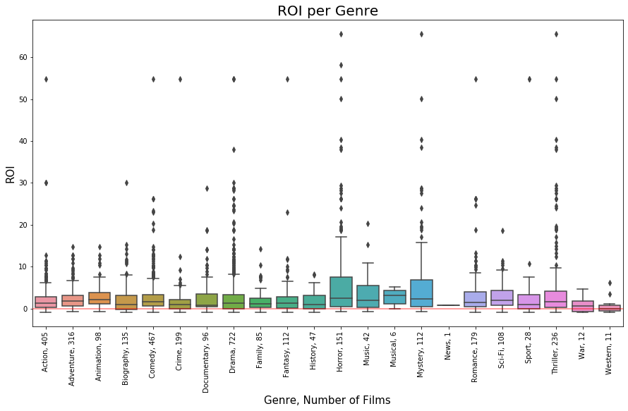
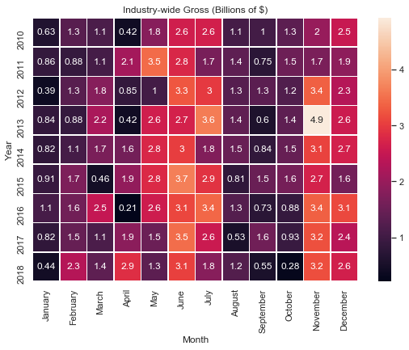
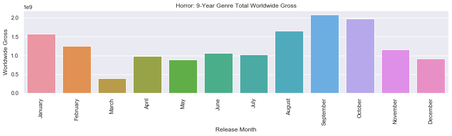
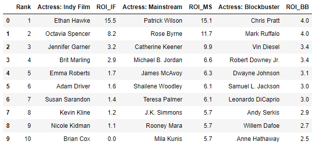
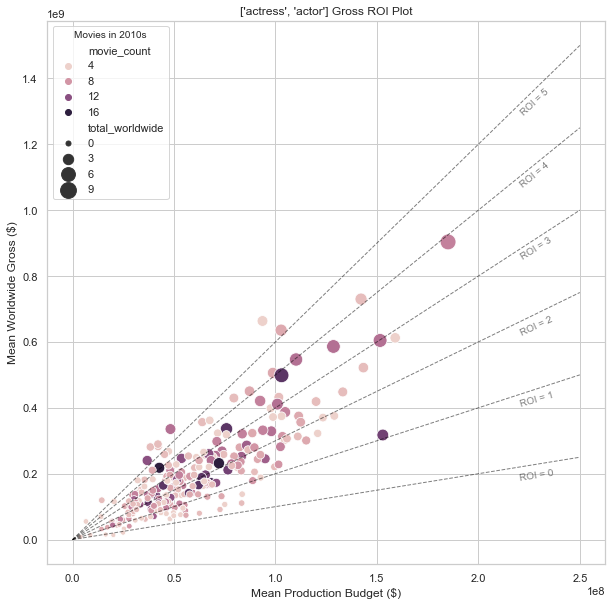
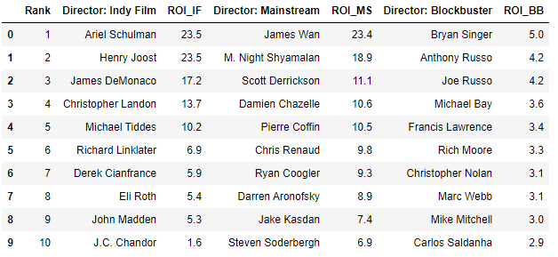
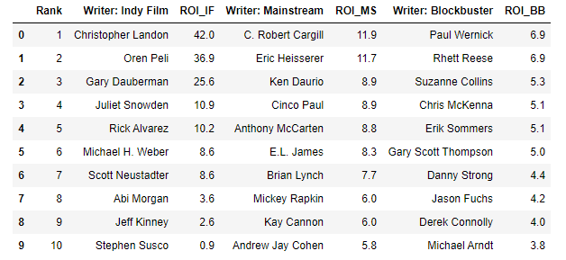

# Project01
Kyle & Jay

# Business Problem:

Microsoft (NASDAQ: MSFT) has decided to enter the original video content production and streaming business similar to Netflix and Amazon Prime. The goal of this project is to analyze the movie data, determine the types of films that has shown success, and based on that make recommendations to Microsoft on the types of film ventures to pursue.

We assumed that Microsoft will be investing in and producing full feature films. The films will be available for distribution in movie theaters world-wide. At the same time, we assumed that Microsoft will launch a streaming platform service like Netflix and Amazon Prime, first starting out in the U.S., featuring Microsoft original films.

## Questions of Interest:

1. Which genre should we start with? (Which genre will generate the highest return on investment (ROI)?)
1. What month is the right time to release to maximize ROI of different genres?
1. What is ideal crew to assemble? (Which directors, writers, and actors have the highest ROI?)
1. Who are the directors that can make the highest grossing flims, regardless of budget? We applied the threshold of film gross revenues of USD 20 million and USD 100 million to classify movies in independent, mainstream, assnd blockbuster categories.

# Dataset

The following dataset has been used in the analysis:
 - Box Office Mojo
 - IMDB
 - Rotten Tomatoes
 - TheMovieDB.org
 
 Every movie has a unique ID that ties to the title, the crew (directors & writers), the actors, the budget and the gross revenues, and genres.
 
 Findings & Recommendations
 
 # Findings & Recommendations

We recommend that for its studio launch Microsoft pursues Horror film genre, targetting release month of December, employing highest ROI directors, writers, and actors.

If gaining market traction after the initial foray into the movie studio is the goal, then we recommend going with the highest grossing dirctors: Anthony Russo (worldwide) and Ryan Coogler(US domestic).

 Please refer to the narrative [Jupyter Notebook](Movies_Project_final.ipynb) in this repository for a walkthrough and more explanation of these findings.
 
 ## Q1: Genres
 Horror films have the highest ROI compared to any other genres.
 
 
  
 ## Q2: Release Month
 While October is the highest grossing month for the horro films, high number of releases drive the mean ROI down. December would be a better month to attain higher ROI.
 
 
  
 
 ## Q3: Highest ROI (Directors, Writers, Actors)
 For independent, mainstream, and blockbuster categories, here are the group of highest performing crew and actors:
 
 
 
  
  
 
 
 
  
 ## Q4: Highest Gross Revenue (Directors, WW/Domestic)
 For highest grossing regardless of budget, we recommend going with the highest grossing dirctors: Anthony Russo (worldwide) and Ryan Coogler(US domestic).
 
 
 
 
 # Limitations & Future Studies
 This analysis assumes movie theater release. The movie business is currently severely affected by the COVID and the historical data used in this analysis may not be reflective of the future market condition. 
 
 Also, while Microsoft is expected to launch content streaming business, streaming viewership data has not been incorporated in this study. Next project should look into the streaming data and see what types of movies will be most profitable/highest grossing for Microsoft.
 
 While crews and actors/actresses have been recommended, any existing contractual obligations that may preclude Microsoft from hiring them have not been taken into account.
 
 